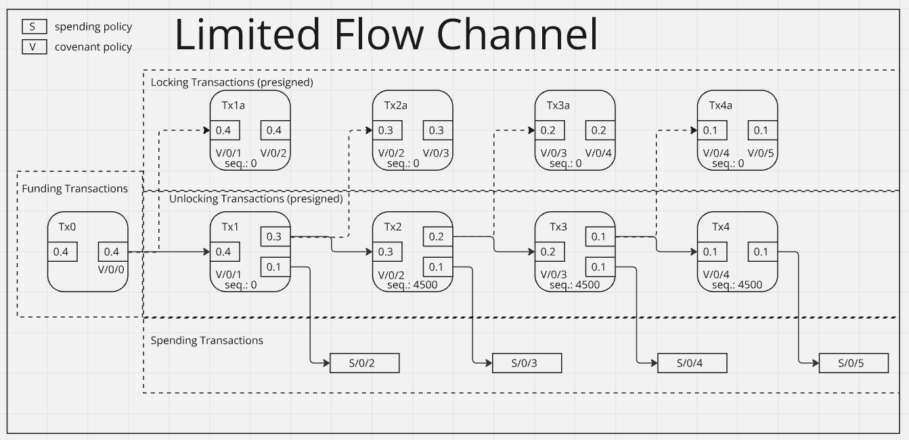

# Limited Flow Channel



## Architecture

For a simple example we will assume our rate limited spending condition is "signature from A"
and our non rate limited spending condition is "signature from B ".

### S spend policy

For our simple example `S` will be defined as `pk(A)`

### M master policy

For our simple example `M` will be defined as `pk(B)`

## Usage
```
Usage: lfc [OPTIONS] [WALLET] <COMMAND>

Commands:
  status     Display the status of the wallet
  conf       Generate a new wallet config
  create     Create a chain of transaction
  sign       Sign all presigned PSBTs
  unlock     Start an unlock round
  register   Register a confirmed transaction
  lock       Broadcast a lock transaction if available
  relock     Relock an available coin
  spend      Spend from an available coin
  spendable  List spendable coins
  del        Delete the wallet
  help       Print this message or the help of the given subcommand(s)

Arguments:
  [WALLET]  Wallet name [default: lfc]

Options:
  -r, --raw                option to output raw json to stdout
  -d, --datadir <DATADIR>  Path supplied by user
  -h, --help               Print help
```
```

```
